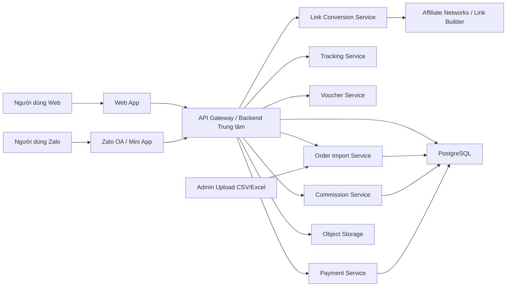

# Kiến trúc hệ thống Web + Zalo cho affiliate hoàn tiền

## 1. Nguyên tắc kiến trúc

- Web và Zalo chỉ là hai kênh vào.
- Toàn bộ nghiệp vụ nằm ở backend trung tâm.
- Tracking phải được sinh một lần, lưu một nơi, dùng lại cho mọi kênh.
- Đối soát đơn hàng phải đi qua một pipeline import chuẩn.
- Không để logic nghiệp vụ nằm rải rác ở frontend hoặc trong bot.

## 2. Sơ đồ tổng thể

## 3. Thành phần chính

### Web App

- Trang đổi link nhanh.
- Admin dashboard.
- Quản lý khách hàng.
- Quản lý voucher.
- Upload file đối soát.
- Theo dõi công nợ và thanh toán.

### Zalo OA

- Nhận link sản phẩm từ người dùng.
- Gửi link affiliate đã chuyển đổi.
- Có thể kèm voucher phù hợp.
- Có thể mở rộng gửi thông báo trạng thái đơn và thanh toán.

### Zalo Mini App

- Không bắt buộc cho MVP.
- Nên thêm sau khi OA ổn định.
- Phù hợp cho tra cứu lịch sử link, lịch sử đơn, số dư hoàn tiền.

### Backend trung tâm

Gồm các service sau:

- `identity-service`
- `customer-service`
- `link-conversion-service`
- `tracking-service`
- `voucher-service`
- `order-import-service`
- `commission-service`
- `payment-service`
- `notification-service`

## 4. Luồng nghiệp vụ chính

### Luồng đổi link trên web

1. Admin hoặc người dùng nội bộ dán link sản phẩm vào web.
2. Backend chuẩn hóa link.
3. Backend xác định nền tảng.
4. Backend sinh tracking code.
5. Backend tạo link affiliate mới.
6. Backend lưu lịch sử.
7. Web trả về link đã chuyển đổi và voucher liên quan.

### Luồng đổi link qua Zalo

1. Người dùng gửi link vào OA.
2. OA chuyển sự kiện về webhook/backend.
3. Backend xử lý cùng pipeline như web.
4. Backend trả về link affiliate + voucher + hướng dẫn.
5. OA gửi phản hồi lại người dùng.

### Luồng đối soát đơn hàng

1. Admin tải file báo cáo từ dashboard affiliate.
2. Upload file lên admin web.
3. Hệ thống preview và map cột.
4. Hệ thống đọc `order_id`, `click_id/sub_id`, commission, trạng thái đơn.
5. Hệ thống map đơn về khách hàng.
6. Hệ thống tính số tiền hoàn 80/20.
7. Hệ thống ghi nhận công nợ thanh toán.

## 5. Thiết kế backend khả thi cho MVP

### Cách làm nên chọn

- Monolith module hóa.
- Một codebase backend thống nhất.
- API dùng REST.
- Webhook riêng cho Zalo.

### Vì sao không nên tách microservice ngay

- MVP cần ra nhanh.
- Nghiệp vụ chưa quá lớn.
- Tránh tăng chi phí vận hành sớm.
- Dễ debug luồng tracking và import đối soát hơn.

## 6. Cơ chế tracking

Tracking code nên có dạng:

- `platform`
- `customer_id`
- `channel`
- `timestamp`
- `sequence`

Ví dụ:

- `SP_C123_WEB_20260711_0001`
- `TT_C123_ZALO_20260711_0002`

Hệ thống lưu:

- tracking code
- link gốc
- link đã chuyển đổi
- người tạo
- kênh tạo
- phiên bản rule chuyển link

## 7. Yêu cầu bảo mật

- Token OA và secret để ở backend, không để lộ ở frontend.
- Toàn bộ thao tác admin phải có phân quyền.
- File import phải lưu bản raw để audit.
- Mọi chỉnh sửa tay với đơn hàng và thanh toán phải có audit log.
- Ảnh bill và file upload cần lưu private.

## 8. Các điểm cần POC riêng

- Phương thức tạo link affiliate thực tế của Shopee/TikTok đang dùng.
- Khả năng gắn tracking theo network thực tế.
- Cấu trúc file đối soát từng network.
- Giới hạn trả lời tự động của Zalo OA.
- Có thể gửi chủ động thông báo lại cho người dùng trong trường hợp nào.
- Bot nhóm Zalo có khả thi hay không.

## 9. Kết luận kiến trúc

Kiến trúc đúng cho bài toán này là:

- 1 backend trung tâm
- 2 kênh vào là web và Zalo
- 1 database nghiệp vụ
- 1 pipeline import đối soát chuẩn

Đây là cấu trúc vừa chắc chắn khả thi, vừa dễ mở rộng về sau.
